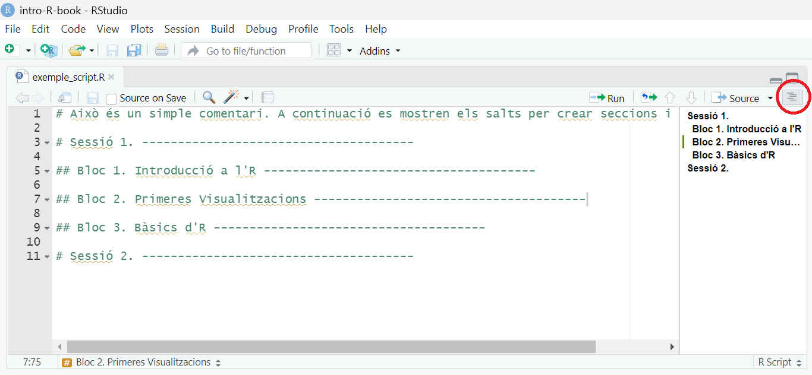

# Primer contacte amb R i el seu entorn

::: objectius-box
<h3>Objectius de la sessió</h3>

-   Entendre què és R i per a què serveix.

-   Familiaritzar‑se amb RStudio i l'entorn de treball.

-   Aprendre a instal·lar i carregar paquets i a trobar informació sobre funcions.

-   Fer els primers passos en R de manera fàcil i ràpida

-   Identificar i crear els objectes bàsics d'R.
:::

## Introducció a R

### Què és R?

**R** és un llenguatge de programació i entorn de software lliure orientat a l'estadística, l'anàlisi de dades i la visualització gràfica. És àmpliament utilitzat en camps com la bioinformàtica, la biotecnologia, l'epidemiologia i les ciències socials.

<br>

### Què és RStudio?

**RStudio** és un entorn de desenvolupament integrat (IDE) per treballar amb R. Facilita l'escriptura de codi, l'organització de projectes i la visualització de resultats gràfics i taules. Per poder treballar amb RStudio es necessita tenir R instal·lat prèviament a l'ordinador

El programari que fa possible treballar amb R es distribueix en paquets o llibreries (*packages*). Cada paquet conté funcions que ens faciliten enormement la programació i ens estalvien haver de començar el codi des de zero. Podem imaginar-ho amb una metàfora: construir una casa amb peces prefabricades és molt més ràpid que aixecar-la totxo a totxo. De la mateixa manera, les funcions que incorporen els paquets d'R actuen com a blocs de codi reutilitzables que ens permeten treballar més ràpid, amb més seguretat i amb menys esforç.

<br>

### Com instal·lar l'R i l'Rstudio

Si encara no t'has instal·lat aquests dos programes pots fer-ho ara seguint les instruccions, que hi navegarem junts!

**Instal·lació R** per [Windows](https://cran.r-project.org/bin/windows/base/) i [Linux](https://linuxize.com/post/how-to-install-r-on-ubuntu-20-04/)

**Instal·lació Rstudio** la [versió per escriptori](https://www.rstudio.com/products/rstudio/)

<br>

### Les 4 finestres principals de RStudio

D'entrada, quan obris RStudio et trobaràs amb aquestes quatre finestres principals (Figura \@ref(fig:fig-rstudio)), cada una té la seva funció específica.

```{r fig-rstudio, echo=FALSE, fig.align="center", fig.cap="Interfície de RStudio", out.width="70%"}
knitr::include_graphics("img/rstudio-panes-labeled.jpeg")
```

<br>

1.  **Editor de scripts** (*Script Panel*)

    -   Escriu i desa codi R per reutilitzar-lo.

    -   Arxius `.R`, `.Rmd`, etc.

2.  **Consola** (*Console*)

    -   Executa codi directament i mostra els resultats.

3.  **Entorn i historial** (*Environment / History*)

    -   Llista dels objectes creats.

    -   Historial de comandes usades.

4.  **Gràfics, arxius, ajuda i paquets** (*Plots / Files / Help / Packages*)

    -   Visualitza gràfics generats.

    -   Accedeix a fitxers, paquets instal·lats i ajuda.


<div class="consell-box">
  <div class="consell-title">💡 Consell</div>
  <p> Tot allò que escriguis a la **consola** no quedarà guardat. Si el que vols és guardar el codi, has d'obrir un nou **script**: `File > New File > R script`. Aquest script és un fitxer de text que el pots guardar a qualsevol carpeta del teu ordinador.
  </p>
</div>

<br>

## Un cas pràctic per començar: el conjunt de dades laryngoscope

### Explorar i entendre les dades

Potser et pot semblar que comencem la casa per la teulada, però iniciar-te amb R generant gràfics visuals de les dades farà que entris en matèria molt més fàcilment.

Per fer-ho utilitzarem un conjunt de dades disponibles al paquet d'R [*medicaldata*](https://higgi13425.github.io/medicaldata/) i les funcions de visualització i creació de gràfics de [*ggpubr*](https://rpkgs.datanovia.com/ggpubr/reference/index.html).

Per poder utilitzar els paquets cal:

**1r.** Instal·lar el paquet des del seu repositori, en aquest cas el [CRAN](https://cran.r-project.org/). Per fer-ho executa el següent codi:

```{r eval=FALSE, message=FALSE, warning=FALSE, include=TRUE}
install.packages("medicaldata")
install.packages("ggpubr")
```

**2n.** Carregar el paquet a la sessió actual:

```{r message=FALSE, warning=FALSE}
library(medicaldata)
library(ggpubr)
```

::: consell-box
::: consell-title
💡 Important
:::

Només cal instal·lar els paquets una sola vegada (`install.packages()`). En canvi, s'han de carregar a la sessió cada vegada que n'obres una de nova (`library()`)
:::

<br>

Ara ja podem importar les dades per començar a treballar:

```{r}
dades <- medicaldata::laryngoscope 
```

La fletxa `<-` crea un nou objecte, un **data frame**, amb el nom de `dades`, que conté les dades de de *laryngoscope* que hem importat. Els data frames són taules rectangulars formades per columnes (normalment variables) i files (observacions). Per visualitzar el data frame amb les nostres dades, podem escriure el nom de l'objecte:

```{r}
head(dades)
```

Aquest conjunt de dades prové d'un estudi aleatoritzat que compara dos mètodes d'intubació orotraqueal per a una cirurgia programada [[1](https://doi.org/10.1213/ANE.0b013e31822cf47d)]. Es van registrar les dades demogràfiques dels pacients, les mesures d'avaluació de la via aèria, la taxa d'èxit de la intubació, el temps fins a la intubació, la facilitat de la intubació i l'aparició de complicacions.

El conjunt de dades inclou 99 observacions (files) i 22 variables (columnes). Fixa't amb el resultat de `dim(dades)`:

```{r}
dim(dades)
```

En R, la primera posició fa referència sempre a les files, i la segona posició a les columnes. 
```{r}
nrow(dades); ncol(dades)
```

Concretament, les variables són les següents:

```{r}
colnames(dades)
```

R automàticament detecta les variables (numèriques o categòriques) en funció de si contenen números o text. Amb la funció `str()` pots comprovar l'estructura de totes les variables que ha assigat l'R de manera predeterminada.

```{r}
str(dades)
```

Potser notaràs que hi ha alguna cosa que no quadra...totes les variables són numèriques?

::: consell-box
::: consell-title
💡 Consell
:::

Per saber-ne més sobre el conjunt de dades executa l'ajuda mitjançant `?laryngoscope`. Pots utilitzar aquest recurs per conèixer més sobre qualsevol funció.
:::

#### Els factors en acció {.unnumbered}

Si has donat un cop d'ull a la descripció de les variables mitjançant `?laryngoscope` hauràs vist que algunes d'aquestes variables són categòriques tot i estar codificades numèricament. En aquests casos, parlem de **factors**.

La funció `factor()` permet transformar qualsevol variable categòrica a factor tenint en compte la codificació de les seves categories. A continuació es mostra el codi per transformar la variable `gender` a factor tenint en compte que 0 = female i 1 = male:

```{r}
# Transformar la variable "gender" a factor:
dades$gender_fct <- factor(dades$gender, levels = c(0, 1), labels = c("female", "male"))
```

-   `<-` genera una nova variable anomenada `gender_fct`. El símbol `$` inclou aquesta variable dins del data frame.

-   `factor()` permet transformar a factor

-   `dades$gener` és la variable categòrica que la funció agafarà com a referència (la que es vol transformar)

-   `levels = c(0, 1)` són els nivells (numèrics) de la variable `gender`

-   `labels = c("female", "male")` són les respectives etiquetes de cada nivell (per ordre) de la variable `gender`. L'ordre dels *levels* i dels *labels* ha de coincidir

Un cop feta la transformació podem comprovar que s'ha executat correctament:

```{r}
str(dades)
```

### Els primers gràfics

El paquet *ggpubr* proporciona una gran varietat de gràfics i estils amb un codi senzill i molt intuïtiu.

::: research-question-box
::: rq-title
Pregunta de recerca
:::

<p>L'índex de massa corporal dels pacients influeix en el temps necessari per fer la intubació?</p>
:::

Per poder respondre a la pregunta i veure la relació entre l'índex de massa corporal del pacient (`BMI`) i el temps total necessari per intubar (`total_intubation_time`) podem graficar un diagrama de dispersió (en anglès *scatterplot*):

```{r}
ggscatter(data = dades, x = "BMI", y = "total_intubation_time")
```

La funció `ggscatter()` crea un gràfic de punts a partir de les dades laryngoscope `data = dades`, col·locant la variable `x = "BMI"` a l'eix horitzontal i la variable `y = "total_intubation_time"` al vertical. Fixa't que el nom de les variables s'escriu entre comes , " ", i conincideix exactament amb el nom de la variable dins del data frame. 

<div class="consell-box">
  <div class="consell-title">💡 Consell</div>
  <p> Sempre que fem referència a un nom l'escriurem entre comes. A més, si fem referència a una variable o etiqueta de dins les dades, ens hem d'assegurar d'escriure el seu nom a la funció del gràfic exactament com està escrita dins del data frame.</p>
</div>


<br>

Totes les funcions de *ggpubr* utilitzen el mateix esquema:

```{r eval=FALSE, include=TRUE}
ggNOM_GRAFIC(data, x, y)
```

A partir d'aquí es poden afegir arguments per modificar l'estètica del gràfic.

Es pot definir el **color** de les observacions mitjançant l'argument `color =`

-   Totes les observacions d'un color en concret indicant el nom del color: `color = "red"`

-   En funció d'una tercera variable (*e.g.* sexe) indicant el nom exacte de la variable en les dades `color = "gender_fct"`

```{r}

ggscatter(data = dades, x = "BMI", y = "total_intubation_time",
          color = "red") # un sol color

ggscatter(data = dades, x = "BMI", y = "total_intubation_time",
          color = "gender_fct") # color en funció del grup/categoria
```

<br>

De la mateixa manera, es pot modificar la **dimensió** o la **forma** de totes els punts mitjançant l'argument `size = 5` o `shape = 8`, o bé en funció d'una variable en concret `size = age` o `shape = treatment`.

```{r}
# Canvi de mida de tots els punts
ggscatter(data = dades, x = "BMI", y = "total_intubation_time",
          size = 5)
```

```{r}
# Canvi de forma de tots els punts
ggscatter(data = dades, x = "BMI", y = "total_intubation_time",
          shape = 8)
```

```{r}
# Canvi de forma en funció d'una tercera variable
ggscatter(data = dades, x = "BMI", y = "total_intubation_time",
          size = "BMI")
```

```{r}
# Canvi de forma en funció d'una tercera variable
ggscatter(data = dades, x = "BMI", y = "total_intubation_time",
          shape = "gender_fct")
```

::: consell-box
::: consell-title
💡 Consell
:::

Consulta els codis/noms de colors disponibles amb la funció `colors()` i les formes mitjançant `show_point_shapes()`.
:::

<br>

Altres arguments del gràfic que es poden modificar de manera ràpida són el **títol** (`title =`), els **noms dels eixos** (`xlab =` o `ylab =`), i el **títol de la llegenda** (`legend.title =`). Recorda que els noms sempre han d'anar entre comes "".

```{r}
ggscatter(data = dades, x = "age", y = "total_intubation_time",
          color = "gender_fct",
          xlab = "BMI",
          ylab = "Temps intubació",
          legend.title = "Sexe")
```

### Exercicis {.unnumbered}

<div class="task-box">
  <div class="task-title">Per practicar!</div>
  <p>-   Continua treballant amb el conjunt de dades *laryngoscope*. Quines dimensions té el data frame? Quantes columnes i quantes files?</p>
  
  <p>-   Creus que el temps que es tarda en intubar als pacients està associat a l'edat? Crea un gràfic per visualitzar la relació entre edat i el temps d'intubació</p>
  
  <p>-   Busca informació sobre les dades amb la funció `?laryngoscope`. Què representa la variable `Randomization`?</p>

  <p>-   Quin tipus de variable és? La seva estructura (per defecte) és correcte? Crea una nova variable dins del data frame anomenada `method_fct` a partir de `Randomization`.</p>

  <p>-   Inclou al gràfic anterior la informació sobre el mètode d'intubació.</p>

  <p>-   Ajusta els noms dels eixos i la llegenda del gràfic.</p>

  <p>-   Creus que hi ha diferències en el temps d'intubació entre homes i dones? Crea un gràfic per visualitzar la relació entre `total_intubation_time` i `gender_fct`.</p>
  
  <details>
<summary>[Solució]{.task-title}</summary>

```{r message=FALSE, warning=FALSE}
# Dimensions
nrow(dades); ncol(dades)

# Descripció de les variables
str(dades$Randomization)

# Transformar a factor la variable Randomization (crear un nova variable)
dades$method_fct <- factor(dades$Randomization, 
                           levels = c(0, 1), 
                           labels = c("Standard Macintosh #4", "AWS Pentaz Video"))
str(dades$method_fct)

# Scatter plot 1: relació Temps total intubació ~ Edat 
ggscatter(data = dades, x = "age", y = "total_intubation_time")

# Scatter plot 2: relació Temps total intubació ~ Edat i method_fct
ggscatter(data = dades, x = "age", y = "total_intubation_time",
          color = "method_fct")

# Scatter plot 3: nom dels eixos i títol de la llegenda
ggscatter(data = dades, x = "age", y = "total_intubation_time",
          color = "method_fct",
          xlab = "Edat",
          ylab = "Temps d'intubació",
          legend.title = "Mètode")

# Scatter plot 4: relació Temps total intubació ~ Sexe
ggscatter(data = dades, x = "gender_fct", y = "total_intubation_time")
```

</details>

</div>

<br>


## Bàsics d'R

Continuarem amb més gràfics i visualitzacions a les properes sessions, però abans anem a repassar algunes claus del llenguatge de codi d'R.

### Bàsics del llenguatge d'R

El software R en si és una calculadora, per tant, pot calcular des de les operacions més bàsiques fins a càlculs complexes. 

Qualsevol operació que escribim al script (o a la consola), R ho detectarà com a càlcul. En canvi, afegint el `#` a l'inici del codi el programa entendrà que és un comentari, i per tant, no calcularà (o executarà) res del que hi hagi a la dreta del símbol. 

Comentar les línies amb `#` et facilitarà a tu (i als teus companys) a llegir i entendre el codi. Pots utilitzar els comentaris per explicar el perquè del codi. A mida que el codi sigui més llarg i complex pots utilitzar *salts* per crear diferents seccions.

```{r eval=FALSE, include=TRUE}
# Això és un simple comentari. A continuació es mostren els salts per crear seccions i subseccions

# Sessió 1. --------------------------------------

## Bloc 1. Introducció a l'R --------------------------------------

## Bloc 2. Primeres Visualitzacions --------------------------------------

## Bloc 3. Bàsics d'R --------------------------------------

# Sessió 2. --------------------------------------
```

Escriu el codi de sobre al teu script i clica a l'icona de dalt a la dreta de la finestra de l'script per visualitzar l'índex de continguts (Figura \@ref(fig:fig2)).

```{r fig2, echo=FALSE, fig.align="center", fig.cap="Finestra del Script d'RStudio. Clicant a l'icona de dalt a la dreta (cercle vermell) es desplega l'índex de continguts del script.", out.width="70%"}

```

<br>

Ara que ja tens les eines principals per poder organitzar el teu propi codi, anem a veure algunes de les possibilitats que ens ofereix R.

A continuació hi ha alguns exemples de càlculs bàsics i comentaris:

```{r}
1 + 2 * 5       # Fixa't en l'ordre de les operacions
3/2             # Divisió
log(10)         # Logaritme natural amb base e
5^2             # 5 al quadrat
sqrt(16)        # Arrel quadrada
abs(3-7)        # Nombre absolut de 3-7
pi              # Nombre pi
exp(2)          # Funció exponencial 
```

<br>

També podem assignar valors a un objecte determinat i fer operacions amb ell:
```{r}
# Assignació d'un valor utilitzant "<-" 
x <- 5
# Operació amb el valor assignat a x
x*2
```

Totes les instruccions amb R en les quals es crea un objecte (**instruccions d'assignació**) tenen la mateixa estructura:

      nom_objecte <- valor

Quan llegeixis aquest codi, digues mentalment: ‘el nom de l’objecte rep el valor’.


<div class="consell-box">
  <div class="consell-title">💡 Consell</div>
  <p> Et faràs un tip de generar instruccions d'assignació i `<-` és poc pràctic de teclejar. Com a alternativa pots fer servir la drecera de RStudio: `Alt` + `-` (tecla Alt alhora que la del símbol menys)
  </p>
</div>

A l'hora d'executar el codi, R no té en compte els espais ni els canvis de línia dins del codi, però segurament tu agrairàs llegir el codiambespaisbenposats.

<br>

T'hauràs adonat que quan crees un objecte, no veus el seu valor. T'aconsello que sempre que facis una instrucció d'assignació visualitzis el valor de l'objecte que acabes de construir. Ho pots fer simplement escribint el seu nom. 

```{r}
objecte_a <- 12.3

objecte_a
```

Per veure el valor de l'objecte quan el construeixes pots afegir `(` a l'inici i `)` al final de la instrucció:
```{r}
(objecte_a <- 12.3)
```

<div class="consell-box">
  <div class="consell-title">💡 Consell</div>
  <p> Una altra drecera d'RStudio per escriure ràpidament els noms dels objectes creats (molt útil sobretot pels noms llargs!): escriu "ob" + `TAB` + selecciona el teu objecte 
  </p>
</div>

#### Tipus de valors

Els valors no només són numèrics, sinó que hi ha diferents tipus de valors amb característiques molt diferents:

- *integers* (números enters): -1, 0, 2, 2025

- *doubles*/*numerics* (números contínus): -24.56, 0.32

- *logicals*: TRUE, FALSE

- *characters*: "home", "vermell", "Hola, avui fa un bon dia"

<br>

Per saber amb quin tipus estem treballant podem utilitzar la funció `class()`

```{r}
class(-24.56)     # numèric
class(TRUE)       # logical
class("home")     # character

is.factor(-24.56) # Com s'interpreta aquest resultat?
```

A les properes sessions veurem que podem crear objectes que continguin un conjunt de valors. Aquests s'anomenen **vectors**.


### Les peculiaritats dels noms

Ets lliure de posar els noms que tu vulguis als teus objectes, però hi ha alguns criteris que ha de complir qulsevol nom:

-   Ha de començar amb una lletra

-   Pot contenir lletres, números, `_` i `.`

Els noms dels objectes han de ser descriptius, és per això, que hauràs de buscar algun tipus de "convenció" pels noms amb més d'una paraula. Personalment, et recomano utilitzar la barra baixa per separar paraules, però hi ha altres opcions:

```{r eval=FALSE, include=TRUE}
jo_faig_servir_barra_baixa

altresPersonesFanServirMajuscules

algunes.persones.punts

I_unsQuants.REBUTGENlaConvenció
```

Per escollir bons noms hauràs de trobar l'equilibri entre la llargada (ni massa curt ni massa llarg) i la quantitat d'informació que descriu. Tot i que els noms curts són fàcils i ràpids d'escriure, utilitzar masses abreviatures farà que perdis temps en desxifrar cada una d'elles si no te'n recordes. 

Quan has de crear diferents objectes relacionats amb un mateix tema o projecte, et recomano que siguis consistent i utilitzis un patró determinat. 

Crea un nou objecte:
```{r}
r_rocks <- 2^3
```

Prova de visualitzar l'objecte mitjançant:
```{r eval=FALSE, include=TRUE}
r_rock

R_rocks
```

R et farà tots els càlculs que vulguis, però tu t'has d'assegurar d'escriure les instruccions de manera correcta i precisa. El cas anterior és un exemple clar d'aquest acord entre tu i R. El programa no pot endevinar les eves intencions, per tant, t'has d'assegurar que li dones les instruccions correctes.

### Les llibreries i les funcions d'R

Les llibreries  d'R (també anomenats paquets) són col·leccions de funcions i dades desenvolupades per la comunitat. Aquests incrementen el potencial d'R millorant les funcions base d'R o afegint-ne de noves.

T'has d'imaginar R com un garatge amb diferents caixes d'eines que corresponent les llibreries d'R. Cada eina (funció d'R) és útil per executar una tasca en concret i es troba dins la seva caixa (llibreria). Per utilitzar qualsevol de les eines has d'agafar la caixa que toca i obrir-la (carregar la llibreria a la sessió d'R). Si no tens la caixa on hi ha l'eina que et fa falta l'hauràs d'anar a comparar prèviament (instal·lar el paquet, això només un sol cop!). 

Els paquets s'allotgen a repositoris especifics des d'on ens els podem descarregar. **CRAN** i **Bioconductor** són els repositoris més populars en el camp de l'estadistica i la bioinformàtica.

**Github** és el repositori més popular per la publicació de projectes *open source*, tot i que no és específic per R.

#### Com instal·lar paquets a R{-}

- CRAN

```
install.packages("ggplot2")
```

- Bioconductor

```
if (!requireNamespace("BiocManager"))
    install.packages("BiocManager")
    
BiocManager::install("limma")
```

La funció `library()` ens permet carregar les llibreries a la sessió on estem treballant.


#### L'estructura de les funcions{-}

Les funcions d'R segueixen totes una mateixa estructura de codi:

    nom_funcio(arg1 = val1, arg2 = val2, ...)
    
Per entendre l'estructura de les funcions utilitzarem `seq()` que crea **seq**üències de números. 

Escriu `seq` i veuràs que et surten diferents opcions. Posa't sobre `seq()` i t'apareixarà una finestra amb algunes especificacions sobre la funció. Per aprofundir més sobre la funció pots escriure `?seq()`.
Selecciona `seq()` i R t'escriurà els dos parèntesis. Dins d'ells escriu el nom del primer argument `from` i assigna-hi `1`. Ara escriu el nom del segon argument `to` i assigna-hi `10`. Finalment prem `Enter`.

```{r}
seq(from = 1, to = 10)
```

A vegades, ens podem estalviar d'escriure els noms dels arguments i introduim els valors corresponents directament (mantenint l'ordre especificat per la funció). El següent codi genera el mateix resultat que l'anterior:
```{r}
seq(1, 10) # el primer valor fa referència sempre a `from`; i el segon valor a `to`
```

Escriu el següent codi (no facis copia i enganxa) i veuràs que a l'obrir les comes, l'Rstudio t'escriu les comes de tancament.
```{r}
x <- "hola!"
```

Els parèntesis i les comes han d'anar sempre en parelles: un obre i l'altre tanca.

Pots provar el què passa quan executes el següent codi: `x <-  "hola!`. El resultat és (observa la teva consola):
```{r eval=FALSE, include=TRUE}
> x <-  "hola!
+ 
```

El símbol `+` indica que R creu que encara no has acabat, i espera que li donis més input. Pots acabar-li d'escriure les comes que falten `"` (des de la consola) o bé clicar `ESC`.


Ara mira la finestra de "*Environment*" d'RStudio. Allà hi pots veure tots els objectes que has anat creant.

### Exercicis {-}

<div class="task-box">
  <div class="task-title">Per practicar!</div>
  
  <p>-   Crea tres objectes: (I) `nom` amb el teu nom, (II) `edat` amb una edat, (III) `sanitaria` amb TRUE o FALSE.</p>
  
  <p>-   Comprova la classe de cada objecte.</p>
  
  <p>-   Canvia `edat` a caràcter amb la funció `as.character(edat)` i explica què passa quan proves edat + 1.</p>

</div>

Els següents exercicis s'han extret del llibre *R for Data Science (II edició)*, estrit per Hadley Wickham, Mine Çetinkaya-Rundel, and Garrett Grolemund. [[2](https://r4ds.hadley.nz/)]

<div class="task-box">
  <div class="task-title">Per practicar!</div>
  <p>-   Fixa't en el següent codi. Sabries identificar l'error?</p>
  
```{r eval=FALSE, include=TRUE}
my_variable <- 10
my_varıable
#> Error: object 'my_varıable' not found
```
  
  
  <p>-   Corregeix les següents línies per tal d'executar el codi correctament:</p>
```{r eval=FALSE, include=TRUE}
library(gpubr)

ggscatter(dada = dades, x = "Age", y = "Ease")
```
  
  <details>
<summary>[Solució]{.task-title}</summary>

```{r message=FALSE, warning=FALSE, eval=TRUE, include=TRUE}
# Errors de codi (I)
my_variable <- 10
my_variable # el nom ha de ser exactament el mateix del de l'objecte que hem creat

# Errors de codi (II)
library(ggpubr)

ggscatter(data = dades, x = "age", y = "ease")
```

</details>

</div>

<br>


## Bibliografia

1.  Abdallah, R., Galway, U., You, J., Kurz, A., Sessler, D. I., & Doyle, D. J. (2011). A randomized comparison between the Pentax AWS video laryngoscope and the Macintosh laryngoscope in morbidly obese patients. Anesthesia and analgesia, 113(5), 1082--1087. <https://doi.org/10.1213/ANE.0b013e31822cf47d>

2. Grolemund, G., & Wickham, H. (2017). R for Data Science. O’Reilly Media. <https://r4ds.hadley.nz/>
