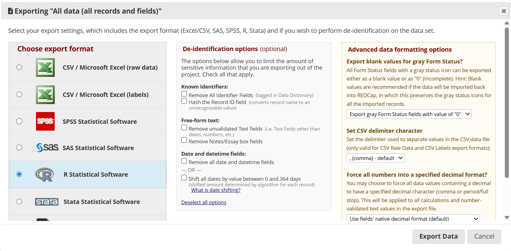
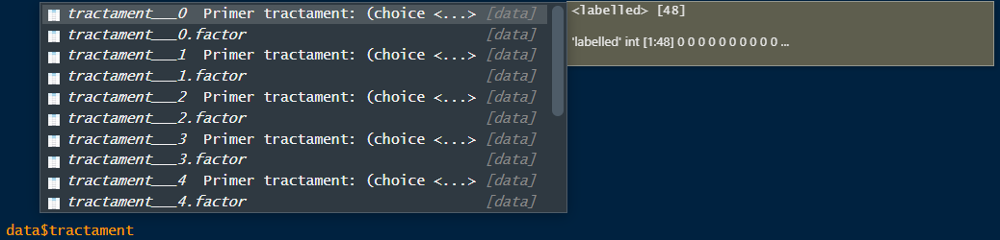

# Importació i manipulació de dades amb R

<div class="objectius-box">
  <h3>Objectius de la sessió</h3>
  
- Importar dades de diferents formats

- Manipular datasets: transformar i seleccionar variables, filtrar files... 

- Conèixer funcions bàsiques d’R

- Utilitzar funcions del tidyverse

</div>


```{r message=FALSE, warning=FALSE, include=FALSE}
library(kableExtra)
```


A la sessió anterior vam veure com assignar valors a un objecte mitjançant `<-`. Els objectes poden contenir un únic valor, com per exemple `objecte_a <- 12.3` o bé poden ser conjunts de valors. 

Aquests conjunts de valors poden pendre diferents formes:

-   vectors

-   factors

-   data frames

-   matrius

-   llistes


## Vectors

Els vectors són conjunts de valors, numèrics, caràcters o lògics, que es creen amb la funció `c()`

```{r}
# vector
c(1, 2, 3)
# assignació d'un vector numèric
vec01 <- c(1, 2, 3)
vec01
class(vec01)
# assignació d'un vector de caràcters
vec02 <- c("Bon", "dia")
vec02
class(vec02)
#assignació d'un vector lògic
vec03 <- c(TRUE, FALSE, T, T, F, F)
vec03
class(vec03)
```

També es poden assignar noms als valors del vector
```{r}
vec01 <- c("a" = 1, "b" = 2, "c" = 3) 
vec01
names(vec01)
```

Els claudators `[` `]` permeten accedir (cridar) elements de dins del vector de manera individual mitjançant l'estructura: `nom_vector["nom_element"]` o bé `nom_vector["num_posicio"]`
```{r}
# podem cridar l'element dins del vector pel seu nom:
vec01["c"]

# o el podem cridar per posició
vec01[3]
```

Per cercar dins dels vectors i trobar els elements que compleixen una determinada condició, podem aplicar **operacions lògiques** mitjançant  `<`, `<=`, `>`, `>=`, `!=` i `==`

-   Operació lògica amb una sola condició:
```{r}
vec01[vec01==2]

vec01[vec01<2]

vec01[vec01>2]

vec01[vec01>=2]

vec01[vec01!=2]
```

-   operació lògica amb dues (o més) condicions:
```{r}
# per indicar que es compleixin totes les condicions: & 
vec01[vec01<3 & vec01>1] # s'ha de complir la 1ra condició i la 2na

# per indicar que es compleixi almenys una de les condicions: |
vec01[vec01<3 | vec01>1] # s'ha de complir la 1ra condició i/o la 2na
```

La funció `which()` retorna la posició del vector que compleix la condició especificada:
```{r}
vec04 <- c(1:5, 13, 17, 20, 25) # crea un vector amb els valors de l'1 al 5 (1:5), 13, 17, 20 i 25
vec04[vec04>5] # valors de vec04 que són més grans de 5
which(vec04>5) # posicions de vec04 les quals el seu valor és major a 5
```
Treballar amb índex de posicions és útil quan s'han de gestionar vectors grans.

<br>

Amb els vectors també podem fer operacions matemàtiques més o menys complexes:
```{r}
vec05 <- vec01*2
vec05
```

### Exercicis {-}

<div class="task-box">
  <div class="task-title"> Per practicar!</div>


  <p>-    Crea un vector de valors del 5 al 10   </p>

<details>
  <summary><span class="task-title">Solució</span></summary>
  
```{r}
c(5, 6, 7, 8, 9, 10) 
c(5:10) # és el mateix (números consecutius)
```
</details><br>

  <p>-    Crea un vector dels noms dels gens PAX6,ZIC2,OCT4 i SOX2. Quin tipus de vector és?</p>

<details>
  <summary><span class="task-title">Solució</span></summary>
  
```{r}
gene_names <- c("PAX6","ZIC2","OCT4", "SOX2") 
class(gene_names) # és un vector de caràcters (character vector)
```
</details><br>

  <p>-    Crea un vector, anomenat `x`, amb les abundàncies (*counts*) dels gens següents: PAX6 = 5, ZIC2 = 1, OCT4 = 3, SOX2 = 10. Un cop creat divideix el vector per la suma total de les abundàncies dels quatre gens (anomena `x_rel` a aquest segon vector) per obtenir les abundàncies relatives. Finalment, troba el(s) gen(s) amb una abundància relativa superior a 0.1.</p>

<details>
  <summary><span class="task-title">Solució</span></summary>
  
```{r}
x <- c("PAX6" = 5,"ZIC2" = 1,"OCT4" = 3, "SOX2" = 10) 
x # vector amb els counts de cada gen
sum(x) # aquesta funció calcula la suma de tots els valors del vector
x_rel <- x/sum(x) # vector amb les abundàncies relatives
x_rel
x_rel[x_rel>0.1] # gens amb abundància relativa superior a 0.1
```
</details>


</div>

<br>


## Factors

Els factors són una sèrie de valors de tipus *character* amb uns nivells o categories (*levels*) definits. Cada nivell se li pot assignar una etiqueta específica.

Els factors es creen utilitzant la funció `factor`.


```{r}
# aquest és un vector de text (string)
ch_st <- c("Bon dia", "Com esteu?")
class(ch_st)

# aquest és un factor
ch_ft <- factor(x = c("a", "b", "b"))
class(ch_ft)
ch_ft
```

Els nivells o categories (levels) del factor estan ben definides, i per tant, no podem afegir valors al factor que no estiguin dins dels nivells
```{r}
ch_ft[4] <- "j"
```

<br>

Treballar amb factors és molt útil quan hi ha variables categòriques però estan codificades amb números. 
Per exemple, el *Sexe* pot estar codificat amb 0 per masculí i 1 per femení:
```{r}
s <- c(0,0,1,1,1,1,0,0,1,0,0,0)
s
class(s)
```

En aquest cas, podem definir que tots els 0 corresponguin al sexe masculí i els 1 al sexe femení:
```{r}
s_ft <- factor(s,                       # vector original (on hi ha la informació de la variable)
               levels = c(0,1),         # codificació numèrica de la variable
               labels = c("M", "F"))    # etiquetes de cada un dels nivells/categories
s_ft
class(s_ft)
```

L'ordre amb el qual especifiquem `levels` i `labels` ha de coincidir. 
```{r}
s_ft2 <- factor(s,                       
               levels = c(1,0), # ordre del nivells ha de coincidir amb l'odre de les etiquetes
               labels = c("F", "M"))    
s_ft2
```

Una funció molt útil quan s'analitzen variables factor és `table()`. Aquesta funció retorna el recompte d'observacions que hi ha de cada categoria:
```{r}
# taula de freqüències
table(s_ft)
#taula de freqüències relatives
prop.table(table(s_ft))
prop.table(table(s_ft))*100
```

Per arrodonir a l'enter més proper utilitza la funció `round()`:
```{r}
s_prop <- prop.table(table(s_ft))*100
round(s_prop)
```
També pots definir la quantiat de decimals que desitgis amb l'argument `digits = `:
```{r}
round(s_prop, digits = 3)
```


### Exercicis {-}


<div class="task-box">
  <div class="task-title"> Per practicar!</div>


<p>S'ha analitzat el nivell de dolor de 10 pacients amb ferides cròniques. La variable *dolor* té tres categories que han estat definides de la següent manera: lleu (1), moderat (2), alt (3). Escriu les següents línies de codi per obtenir les dades de dolor d'aquest estudi:</p>
```{r}
set.seed(123)
dolor <- sample(c(1:3), 12, replace = T)
```
  
  <p>-   Converteix a factor la variable dolor definint les categories segons s'especifica a l'enunciat.</p>

<details>
  <summary><span class="task-title">Solució</span></summary>
  
```{r}
dolor_ft <- factor(dolor, levels = c(1,2,3), labels = c("lleu", "moderat", "alt"))
dolor_ft
class(dolor_ft)
```
</details>

  <p>-   Quantes observacions hi ha de cada categoria?</p>

<details>
  <summary><span class="task-title">Solució</span></summary>
  
```{r}
table(dolor_ft)
prop.table(table(dolor_ft))
prop.table(table(dolor_ft))*100
```
</details>

  <p>-   Canvia l'ordre de les categories de major a menor dolor.</p>

<details>
  <summary><span class="task-title">Solució</span></summary>
  
```{r}
# (a) canviar l'ordre dels nivells i de les etiquetes al crear al vector
dolor_ft2 <- factor(dolor, levels = c(1,2,3), labels = c("lleu", "moderat", "alt"))
dolor_ft2

# (b) definir l'ordre dels nivells desitjat (a partir del factor ja creat, dolor_fct)
dolor_ft2 <- factor(dolor_ft, levels = c("alt", "moderat", "lleu"))
dolor_ft2
```
</details>

</div>

<br>

## Data frames

Ja hem vist a la sessió anterior que els data frames són taules rectangulars formades per columnes (normalment variables) i files (observacions).
Els podem importar a R des d'un paquet, un full d'excel o bé crear-los directament a R amb la funció `data.frame()` (sempre i quan les dimensions de les dades ens ho permetin!). Hi ha diferents maneres de crear data frames, a continuació es mostra una d'elles:

```{r}
# Creem les diferents columnes per separat en forma de vector:
chr <- c("chr1", "chr1", "chr2")
strand <- c("-","+","+")
start<- c(200,4000,100)
end<-c(250,410,200)

#Utilitzem la funció data.frame() per unir les diferents columnes (vectors)
df <- data.frame(chr,start,end,strand)
class(df)
```

```{r}
View(df) # obre una finestra a RStudio per la visualització de la taula
```

```{r}
str(df)
```

La funció `str()` indica l'estructura de cada una de les columnes del data frame. Permet comprovar que cada variable s'ha llegit de manera correcte.

<br>

Podem canviar els noms de les columnes i de les files al data frame:
```{r}
# NOM DE COLUMNES
colnames(df) # visualitza a la consola el nom de les columnes
colnames(df) <- c("Chromosome", "Start", "End", "Strand") # assigna valors concrets als noms de les columnes
colnames(df)
# NOM DE FILES
row.names(df)
row.names(df) <- c("sample01", "sample02", "sample03")
```


<br>

Per saber les dimensions del data frame utilitzem la funció `dim()` i pel nombre de columnes i files `ncol()` i `nrow()`
```{r}
dim(df)
ncol(df); nrow(df)
```

<br>

Similar als vectors, també podem accedir a columnes, files o cel·les concretes d'un data frame. 

Pel que fa a les columnes, hi ha diferents maneres de fer-ho utilitzant funcions base d'R:

a) Utilitzant `[` `]` i indicant la posició de la columna després de la coma
```{r}
df[,1] # primera columna

df[,c(1, 4)] # primera i tercera columna
```

b) Utilitzant `[` `]` i indicant el nom exacte de la columna després de la coma
```{r}
df[,"Chromosome"]

df[,c("Chromosome", "Strand")]
```

c) Utilitzant `$` i indicant el nom exacte de la columna (sense cometes!). Aquesta alternativa no permet seleccionar més d'una columna.
```{r}
df$Chromosome
df$Strand
```

<br>

Per accedir a les files s'utilitza `[` `]` i indicant la posició de la fila/observació abans de la coma
```{r}
df[2,] # mostra 02

df[c(2,3),] # mostra 02 i 03
```

<div class="consell-box">
  <div class="consell-title">💡 Consell</div>
  <p> Recorda que la primera posició (bans de la coma) fa raferència a les files, i la segona posició (després de la coma) a les columnes. Quan l'espai d'abans/després de la coma es deixa en blanc s'estan seleccionant totes les files/columnes.
  </p>
</div>

### Exercicis {-}

<div class="task-box">
  <div class="task-title"> Per practicar!</div>


<p>Continuant amb l'estudi de les ferides cròniques, crea un data frame amb les variables `edat` i `mida` de la ferida dels 10 pacients analitzats. Escriu les següents línies de codi per obtenir les d'aquestes dues variables</p>
```{r}
set.seed(123)
edat <- sample(c(30:75), 12, replace = T)
mida <- sample(c(0.5:3.5), 12, replace = T)
```
  
  <p>-    Crea un data frame amb les variables `dolor_ft`, `edat`, `mida`</p>

<details>
  <summary><span class="task-title">Solució</span></summary>
  
```{r}
df2 <- data.frame(dolor = dolor_ft, 
                  edat = edat,
                  mida = mida)
df2
```
</details><br> 

  <p>-    Visualitza la segona columna del data frame</p>

<details>
  <summary><span class="task-title">Solució</span></summary>
  
```{r}
df2[,2]
df2[,"edat"]
df2$edat
```
</details><br> 

  <p>-    Visualitza els valors de nivell de `dolor` i `mida` de la ferida de la cinquena mostra</p>

<details>
  <summary><span class="task-title">Solució</span></summary>
  
```{r}
df2[5,c(1,3)]
df2[5,c("dolor", "mida")]
df2$dolor[5]
df2$mida[5]
```
</details><br> 


  <p>-    Identifica on hi ha l'error a les següents línies de codi i corregeix-lo</p>

```
# error 1
df2[, (2,3)]

# error 2
df2[, "Mida"]

# error 3
df2$"mida"
```
<details>
  <summary><span class="task-title">Solució</span></summary>
  
```{r}
# error 1
df2[, c(2,3)] # si volem seleccionar més d'una variable ho hem d'introduir en forma de vector, c()

# error 2
df2[, "mida"] # el nom de la variable ha de ser exactament igual

# error 3
df2$mida # quan s'utilitza $ no s'ha d'escriure el nom entre " "
```
</details>


</div>

<br>

## Matrius

Similars als data frames, les matrius també són un conjunt de dades, però del mateix tipus, que es disposen en una organització rectangular bidimensional.
Es crea mitjançant una entrada vectorial i té un nombre fix de files i columnes.

```{r}
# Exemple de matriu de dues files i tres columnes
mat <- matrix(c(11,22,33,44,55,66), # vector amb totes les dades
              nrow = 2, # defineix el nombre de files
              ncol = 3, # defineix el nombre de columnes
              byrow = 1 # defineix com volem que s'ompli la matriu: en aquest cas per files
              )
mat
class(mat)
str(mat)
```


Tant les matrius com els data frames són taules rectangulars de dades, però les seves diferències principals són:

-   Les matrius tenen un nombre fix de files columnes, mentre que en els data frames és variable

-   En les matrius, les dades només poden ser d'un sol tipus, mentre que els data frames poden combinar columnes amb diferents tipologies de dades (numèric, factor, lògic...)

## Llistes

Són els objectes d'R que contenen elements de diferents tipus com ara números, vectors, data frames, i inclús altres llistes al seu interior. Una llista també pot contenir una matriu o una funció com a elements. 

La funció `list()` permet crear llistes:
```{r}
list_data <- list ("hola", c(1:5), TRUE, 2025)
list_data
```

<br>

Podem accedir als diferents elements de la llista mitjançant `[]`, indicant la posició de l'element. Els elements de la llista poden rebre noms i, per tant, també hi podem accedir mitjançant els seus noms.

```{r}
list_data[1]
list_data[[1]] # Quina diferència hi ha respecte la línia anterior?
```


### Exercicis

<div class="task-box">
  <div class="task-title"> Per practicar!</div>


<p>-   Crea una llista amb noms que contingui: (1) un vector numèric, (2) un factor, (3) una llista amb un  *character*, un *integer*, i un valor *lògic*.</p>

<details>
  <summary><span class="task-title">Solució</span></summary>
```{r}
# (1) un vector numèric
vec_numeric <- c(1:10)

# (2) un factor
fct <- factor(c("sol", "pluja"))

# (3) una llista amb un  character, un integer, i un valor lògic.
llista0 <- list("temps", 5, TRUE)

# Creem la llista amb noms
llista_final <- list(
  vector_numeric = vec_numeric,
  factor_temps  = fct,
  llista_interna = llista0
)
llista_final
```
</details><br> 

<p>-    Accedeix al *integer* dins de la llista interna (3)</p>

<details>
  <summary><span class="task-title">Solució</span></summary>
```{r}
llista_final$llista_interna[[2]][1]
llista_final[[3]][[2]][1]
```
</details>

</div>

<br>


## Organització de les dades

Fins ara hem pogut treballar amb funcions base d'R, però a partir d'ara ens farà falta un paquet anomenat `tidyverse()`. Per tant, primer de tot l'instal·lem i el carreguem:

```{r eval=FALSE, message=FALSE, warning=FALSE, include=TRUE}
install.packages("tidyverse")
```
```{r message=FALSE, warning=FALSE}
library(tidyverse)
```

<br>

Una de les fases més importants, i segurament a la que hi hauràs de dedicar més temps, és l'organització de les dades. En el següent exemple, les tres taules contenen la mateixa informació però es troben organitzades molt diferent. Les variables descrites són: *país*, *any*, *població* i nombre de *casos* de tuberculosi. 

```{r}
table1
table2
table3
```

Les tres taules representen les mateixes dades, i per tant, contenen la mateixa informació. Tot i això, la seva estructura fa que siguin més o menys fàcils de treballar-hi. Concretament, l'organització de la `tabel1` és la que permet treballar de manera més còmode perquè està oganitzada.

Existeixen tres normes generals que defineixen una bona taula de dades \@ref(fig:fig-estructura)):

1.    Les columnes són variables; cada variable correspon a una columna

2.    Les files són observacions; cada observació correspon a una fila

3.    Les cel·les són valors; cada valor correspon a una cel·la

```{r fig-estructura, echo=FALSE, fig.align="center", fig.cap="Les tres normes per l'organització d'una taula de dades: les variables són columnes, les observacions són files i els valors són cel·les. Font:  [Grolemund, G., & Wickham, H. (2017)](https://r4ds.hadley.nz/data-tidy.html#introduction)", out.width="70%"}
knitr::include_graphics("img/estructura.png")
```

I, per què és important organitzar les dades abans de començar a treballar?

La majoria de les funcions d'R que treballen amb les dades estan dissenyades de tal manera que tracten les columnes com a variables, per tant, seguir aquesta estructura d'organització farà que et seigui molt més senzill manipular, transformar i filtrar el teu conjunt de dades.

<br>

Et pot semblar una tonteria dedicar tota una sessió a entendre i aprendre a endreçar i organitzar les dades, però la veritat és possible que la majoria de vegades que hagis d'analitzar unes dades, aquestes no estiguin ordenades. I els principals motius són: 

  (I)   La manera com s'organitzen la majoria de les dades no està pensada per l'anàlisi, sinó per facilitar la seva recollida.
  
  (II)  La majoria de la gent no està familiaritzada amb els principis bàsics de l'organització de dades, a no ser que estiguis molt acostumat a treballar amb dades. 
  
Per aquests motius, la majoria dels anàlisis requeriran un mínim d'organització prèvia de les dades. El primer pas serà sempre identificar quines són les variables importants i quines les observacions. Un cop identificades, s'haurà de manipular l'estructura del conjunt de dades per posar les variables en columnes i les observacions en files.

En aquesta sessió aprendrem a organitzar les dades amb les funcions del paquet `tidyverse()`.


### Una columna, una variable

Començarem amb un conjunt de dades disponibles al paquet `medicaldata` d'un estudi clínic que estudia l'efecte del sulindac en la reducció del nombre de pòlips de còlon en pacients amb poliposi adenomatosa familiar.

Primer carreguem el paquet i observem les dades


```{r}
library(medicaldata)

polips <- medicaldata::polyps
```

```{r echo=FALSE}
head(polips)
```

En aquest conjunt de dades, cada pacient correspon a una fila. Les variables `participant_id`,	`sex` i	`age` descriuen característiques del pacient. La variable `treatment` fa referècia al tractament que ha rebut durant l'estudi (sulindac o placebo). Les altres tres columnes, `baseline`, `number3m`	i `number12m` fan referència al nombre de pòlips a cada visita (inici del tractament, al cap de 3 mesos i al cap de 12 mesos, respectivament). 

Per tal d'organitzar la taula de manera correcta, el primer pas és preguntar-nos quina (o quines) són les variables que ens interessen analitzar. Exemples de possibles preguntes de recerca podrien ser:

::: research-question-box
::: rq-title
Pregunta de recerca
:::

<p>El nombre de pòlips disminueix al llarg del temps?</p>
<p>El tractament amb sulindac redueix més el nombre de pòlips en comparació amb el placebo?</p>
:::

En aquest cas, està clar que per saber si el tractament funciona o no, haurem de fixar-nos en el **nombre de pòlips**. Per tant, si el nombre de pòlips és una de les variables que ens interessa, el segon pas serà ajustar l'estructura de la taula per tal de tenir aquesta informació en una sola columna. Ho farem amb la funció `pivot_longer()` de `tidyverse`:


```{r}
polips_tidy <- polips %>%
  pivot_longer(
    cols = c("baseline", "number3m", "number12m"), # columnes originals que contenen informació sobre el nombre de pòlips
    names_to = c("time_point"), # com volem anomenar la variable que contindrà la informació del nom de les columnes (baseline, number3m, number12m)
    values_to = "n_polips" # com volem anomenar la variable que contindrà la informació sobre el nombre de pòlips
  )
  
```


Els elements clau d'aquesta funció són:

-   `cols` = les variables que volem re-organitzar (pivotar)

-   `names_to` = variable que contindrà la informació continguda als noms de les variables que hem especificat a `cols`

-   `values_to` = variable que contindrà la informació dels valors de cada cel·la

Fixa't que utilitzem "" sempre que ens referim a una columna del data frame, ja sigui una existent o una nova (*e.g.*, `"baseline"`, `"time_point"`, `"n_polips"`).

Ara que tenim els temps de mostreig en una variable (`time_point`) i el nombre de pòlips en una altra (`n_polips`) podem visualitzar com aquests varien al llarg del temps. A continuació es mostra un codi simple per visualitzar-ho. El gràfic mostra com alguns individus redueixen el nombre de pòlips dràsticament, altres l'incrementen i alguns mantenen la mateixa quantitat al llarg de les tres visites.

```{r}
polips_tidy
```

```{r message=FALSE, warning=FALSE}
ggline(polips_tidy, x = "time_point", y = "n_polips",
       group = "participant_id")
```

Per entendre en més detall com opera la funció `pivot_longer()` consulta l'apartat [5.3.2 How does pivoting work? del llibre de Grolemund, G., & Wickham, H. (2017)](https://r4ds.hadley.nz/data-tidy.html#how-does-pivoting-work)

### Noms de columnes que contenen més d'una variable

Una altra situació una mica més complexa amb la qual ens podem trobar és quan els noms de les variables contenen informació que ens interessaria tenir en forma de variables separades. Un exemple d'aquesta situació la trobem en el conjunt de dades `who2`.

```{r}
head(who2)
```


Aquestes dades recollides per l'Organització Mundial de la Salut, contenen informació sobre el diagnòstic de la tuberculosis. Si visualitzes les dades veuràs que hi ha columnes que ja existeixen com a variables i són relativament senzilles d'interpretar: `country` i `year`. Les següents 56 columnes (*e.g.*,`sp_m_014`, `ep_m_4554`, i `rel_m_3544`) no són tant fàcils d'interpretar. De totes maneres, si t'hi fixes, veuràs que segueixen un patró: cada nom de columna està composta per tres parts separades per `_`. La primera part, `sp`/`rel`/`ep`, descriu el mètode utilitzat pel diagnosi; la segona part `m`/`f` fa referència al sexe; i la tercera part, `014`/`1524`/`2534`/`3544`/`4554`/`5564`/`65`, és el rang d'edat (*e.g.*, 014 representa 0-14 anys).

Per tant, el dataset recull informació de 6 variables: `country` i `year` (ja són columnes); el mètode de diagnosi, el sexe i el rang d'edat (dins dels noms d'algunes columnes); i el recompte de pacients de cada categoria (valors de les cel·les). Per tal d'organitzar tota aquesta informació en sis columnes diferents, utilitzarem `pivot_longer()` especificant:

-   `cols` = variables que volem re-estructurar (pivotar)

-   `names_to` = un vector amb els noms de les columnes del data frame resultant (output)

-   `names_sep` = les instruccions per tal de dividir els noms de les columnes originals en tres parts

-   `value_to` = nom per la columna dels recomptes

```{r}
who2 %>% 
  pivot_longer(
    cols = !(country:year), # pivotar totes les columnes excepte country i year
    names_to = c("diagnosis", "gender", "age"), # noms de les noves columnes
    names_sep = "_", # les tres parts les divideix _
    values_to = "count" # nom de la variable que contindrà els recomptes de cada categoria
  )
```


### Noms de columnes que contenen noms i valors de variables

Què passa quan els noms de les columnes contenen informació sobre noms de variables, alhora que valors?

Ara ens fixarem amb l'exemple de l'estudi sobre les intervencions orotraqueals de la sessió anterior. Carreguem les dades i les observem:
```{r}
dades <- medicaldata::laryngoscope
dades
```


Veuràs que hi ha algunes columnes que ja són variables en si (`age`, `gender`, `BMI`, `bleeding`, `ease`, `sore_throat`, `view`). N'hi ha d'altres que fan referència al temps d'intubació i a l'èxit o fracàs en cada intent. Els noms d'aquestes columnes segueixen un patró determinat: `attempt#_``time`/`S_F`/`assigned_method`. 

Abans de continuar però, per tal de mantenir la coherència en els noms de les columnes farem unes petites modficacions prèvies:

-   La variable `Randomization` fa referència al mètode utilitzat en el primer intent d'intubació. Per tant, substituirem el seu nom amb el mateix patró que la resta d'intents: `attempt1_assigned_method`
```{r}
colnames(dades)[6] # correspon a la columna de la sisena posició

colnames(dades)[6] <- "attempt1_assigned_method" # definim mitjançant `<-` el nom correcte

colnames(dades)[6] # comprovem que s'hagi modificat correctament
```

-   El nombre total d'intents l'indicarem amb el nom `total_intubation_attemps`:
```{r}
colnames(dades)[15]

colnames(dades)[15] <- "total_intubation_attemps"

colnames(dades)[15]
```

Ara ja podem procedir a re-estructurar el conjunt de dades.


En aquest cas, els propis noms de les variables a pivotar (*e.g*, `attempt1_time` o `attempt1_assigned_method`) conten informació sobre (I) els **noms** de les variables temps d'intubació `time`, èxit/fracàs `S_F` o el mètode d'intervenció `assigned_method`, però també (II) contenen el **valor** d'una altra variable, l'intent (`attempt#`, amb valors de l'1 al 3).

Per tant, per organitzar aquest conjunt de dades cal indicar a `pivot_longer()` un vector a `names_to` que faci referència a `.value`. Aquest argument no és un nom de variable en si, però indica a la funció que utilitzi part del nom de les variables a pivotar com a noms de les noves variables en l'output. 

```{r}
df_tidy <- dades %>% 
  pivot_longer(
    cols = starts_with("attempt"), # patró que segueixen les variables a pivotar
    names_to = c( "attemptN" , ".value"),
    names_pattern = "attempt(\\d+)_(.*)",
    values_drop_na = TRUE
  )
df_tidy

```

En el codi anterior:

-   `cols = starts_with("attempt")` identifica les variables a pivotar, que són aquelles que comencen per *attemp*: `"attempt1_time"`, `"attempt1_S_F"`, `"attempt2_time"`, `"attempt2_assigned_method"`, `"attempt2_S_F"`, `"attempt3_time"`, `"attempt3_assigned_method"`, `"attempt3_S_F"`

-   `names_to = c("attemptN" , ".value")` crearà una primera variable anomenada `attemptN` (que contindrà els **valors** de cada intent: 1, 2 o 3). `.value` permet anomenar a la resta de les noves columnes a partir d'una part del nom les columnes a pivotar (`time`/`S_F`/`assigned_method`).

-   `names_pattern = "attempt(\\d+)_(.*)"` divideix els noms de les columnes en (I part) el número d’intent (abans de `_` busca un o més dígits, `\\d+`), i (II part) el nom de la variable (després de `_` busca qualsevol cadena de caràcters, `.*`)


## Cas pràctic des de RedCap a R

Per concloure la sessió ens posarem mans a l'obra amb dades d'un projecte sobre càncer de còlon. En aquest cas pràctic s'hauran d'importar les dades, explorar les variables i organitzar el data frame per tal de respondre a les preguntes de recerca específiques. 

### Importar les dades a R

**Descarregar les dades des de REDCap**

La plataforma utilitzada per recollir les dades ha set REDCap, per tant, a continuació es detalla el procés per poder descarregar qualsevol projecte des de REDCap:

1.    Dins del projecte, cal descarregar les dades des del menú lateral: *Applications* > *Data Exports, Reports, and Stats*). 

2.    Un cop dins de Data Exports, Reports, and Stats s'escull el conjunt de dades que es vol descarregar (en aquest cas, *All data*)  i es clica "*Export Data*". 

3.    Al fer-ho s'obre una finestra emergent des d'on es pot escollir el format de descàrrega: *R Statistical Software* (Figura \@ref(fig:fig-download)). Un cop seleccionat es clica *Export Data*.

```{r fig-download, echo=FALSE, fig.align="center", fig.cap="Opcions de format de descàrrega de les dades. En aquest s'escull *R Statistical Software* i es clica *Export Data*", out.width="70%"}

```

Al descarregar les dades, es descarreguen dos fitxers:

-   `CursIntroducciAR-CRC_DATA`: fitxer .csv (comma separated value) que conté les dades

-   `CursIntroducciAR-CRC_R`: fitxer .R que conté el codi amb R per carregar les dades directament.

Pel cas pràctic que farem a continuació no realitzarem aquests passos de descàrrega des de REDCap, i per tant, podeu trobar aquests dos fitxers al següent [link](https://github.com/mpujolassos/curs_r_althaia/tree/main/data)).

**Importar les dades a R**

Per carregar les dades (fitxer *CursIntroducciAR-CRC_DATA.csv*) utilitzarem directament el codi descrit a *CursIntroducciAR-CRC_R.R*. Obrim l'script d'R amb RStudio, definim el directori de treball i executem totes les línies de codi.

**Executar el codi**. Mirem en detall què fan les diferents línies d'aquest codi:

-   Línies del codi 1-7: 

  -   `rm()` i `graphics.off()`: eliminen qualsevol cosa que hi hagi carregat a *Environment* o *Plots*. 
  
  -   `library()`: carrega a la sessió el paquet `Hmisc`, el qual és necessari per carregar les dades correctament. 
  
  -   `read.csv()`: carrega el fitxer amb les dades. Perquè R trobi el fitxer, hem d'escriure el camí de carpetes que l'ordinador ha de seguir fins arribar a ell (indicat com [...]/nom_fitxer en el codi de sota). La carpeta on hi ha les dades l'anomanem *working directory*, ja que és la carpeta des d'on treballarem. Per exemple, si has guardat les dades a una carpeta de l'escriptori anomenada sessio2_caspractic, el camí fins el directori de treball seria: `C:/Escriptori/sessio2_capractic`. En el cas que no sàpigues exactament qui és el camí per arribar a la teva carpeta pots utilitzar els boton de RStudio: `Session` > `Set Working Directory` > `Choose directory...` > Selecciona la teva carpeta.

```{r eval=FALSE, include=TRUE}
#Clear existing data and graphics
rm(list=ls())
graphics.off()

#Load Hmisc library
library(Hmisc)      # Si no el tens instal·lat ho hauràs de fer amb install.packages(Hmisc)

#Read Data
data=read.csv('[....]/CursIntroducciAR-Interval_DATA.csv')
```

-   Setting Labels: introdueix per cada columna, un nom (etiqueta) més explicatiu i fàcil de llegir.

-   Setting Factors: crea noves variables en forma de factor (només per aquelles categòriques) amb la funció `factor()` i en defineix les categories amb `levels()`. 

Exemple de la variable "diagnòstic a través del programa de detecció precoç de càncer de còlon i recte":
```{r eval=FALSE, include=TRUE}
#Setting Labels (exemple)
label(data$pdpccr)="Diagnosticat a través del PDPCCR?"

#Setting Factors(will create new variable for factors)
data$pdpccr.factor = factor(data$pdpccr,levels=c("1","2","3","4"))

levels(data$pdpccr.factor)=c("Sí, PDSOH+","Sí, vigilancia estándar/vigilancia intensiva/poliposis","No, diagnosticats via assistencial","No, càncer de interval")

```

Després d'executar totes les files apareixerà un objecte al teu *Environment* anomenat `data`. Clica sobre el seu nom o bé exacuta `View(data)` per visualitzar en una pestanya les dades.

```{r include=FALSE}
source("data/CursIntroducciAR-CRC_R.R")
```

### Esctructura general de dataframe


Per entendre com està organitzat el data frame fixem-nos amb alguns detalls generals i altres de més específics.

<div class="task-box">
  <div class="task-title"> Estructura general del data frame</div>


 <p>-   Quines dimensions té el data frame? Quantes files i quantes columnes?</p>

<details>
  <summary><span class="task-title">Solució</span></summary>
```{r}
dim(data)

nrow(data); ncol(data)
```
</details><br> 

 <p>-   Visualitza els noms de les columnes</p>

<details>
  <summary><span class="task-title">Solució</span></summary>
```{r}
colnames(data)
```
</details>

 <p>-   Les últimes columnes fan referència a les variables categòriques transformades a factor. On es troben les columnes factors (des de i fins a quina posició (índex) les trobem)?</p>

<details>
  <summary><span class="task-title">Solució</span></summary>
```{r}
## Opció A (manualment)
# Per trobar-les podem donar un cop d'ull a tots els noms de les columnes i manualment identificar la primera variable factor (acaba amb .factor)

## Opció B (amb una funció específica)
# endsWith busca dins del vector colnames(data) aquells elements que acaben amb ".factor"
endsWith(colnames(data), ".factor") # retorna un vector lògic (TRUE/FALSE)

which(endsWith(colnames(data), ".factor")) # which() retorna les posicions (índex) que compleixen la norma (TRUE)
ind.fct <- which(endsWith(colnames(data), ".factor")) # definim un vector amb les posicions (índex) identificades

colnames(data)[ind.fct] # seleccionem els índex del vector colnames(data) definides a ind.fct

colnames(data)[63:111] # si coneixem exactament l'índex de la primera i última columna

```
</details>

 <p>-  Mostra les cinc primeres files de les columnes factor identificades anteriorment?</p>

<details>
  <summary><span class="task-title">Solució</span></summary>
```{r}
# data[files, columnes]
data[1:5, ind.fct]
data[1:5, 63:111]
```
</details>

<p>-  Defineix un nou vector amb l'edat dels pacients en el diagnòstic (variable `edat_diagn`). Anomena aquest vector `edat`</p>

<details>
  <summary><span class="task-title">Solució</span></summary>

```{r}
edat <- data$edat_diagn
```
</details>

<p>-  Quina és l'edat mínima d'aquests pacients? i la màxima?</p>

<details>
  <summary><span class="task-title">Solució</span></summary>

```{r}
min(edat); max(edat)
```
</details>

<p>-  Quants pacients hi ha menors de 65 anys?</p>

<details>
  <summary><span class="task-title">Solució</span></summary>

```{r}
edat < 65 # retorna un vector lògic (TRUE/FALSE)

which(edat < 65) # retorna la posició (índex) dels que compleixen la condició

length(which(edat<65)) # retorna la llargada del vector which(edat < 65), el qual inclou només aquells índex que compleixen la condició especificada

edat[which(edat<65)] # comprovem que les edats seleccionades coincideixin amb el filtre desitjat
edat[edat<65] # mateix resultat que la línia anterior
```
</details>

<p>-  Quants pacients hi ha entre 55 i 60 (inclosos)?</p>

<details>
  <summary><span class="task-title">Solució</span></summary>

```{r}
edat >= 55 & edat <=60 # retorna un vector lògic (TRUE/FALSE)

ind <- which(edat >= 55 & edat <=60) # retorna la posició (índex) dels que compleixen la condició
ind

length(which(edat >= 55 & edat <=60)) # retorna la llargada del vector ind, el qual inclou només aquells índex que compleixen la condició especificada

edat[ind] # comprovem que les edats seleccionades coincideixin amb el filtre desitjat
```
</details>

<p>-  Quants pacients hi ha menors de 55 o bé majors de 65?</p>

<details>
  <summary><span class="task-title">Solució</span></summary>

```{r}
edat < 55 | edat > 65 # retorna un vector lògic (TRUE/FALSE)

ind <- which(edat < 55 | edat > 65) # retorna la posició (índex) dels que compleixen la condició
ind

length(which(edat >= 55 & edat <=65)) # retorna la llargada del vector ind, el qual inclou només aquells índex que compleixen la condició especificada

edat[ind] # comprovem que les edats seleccionades coincideixin amb el filtre desitjat
```
</details>

<p>-  Fixa't ara amb la variable sexe (`sexe` o `sexe.factor`). Quants homes i quantes dones hi ha?</p>

<details>
  <summary><span class="task-title">Solució</span></summary>

```{r}
# variable sexe (numèrica, integer)
str(data$sexe)
table(data$sexe)

# variable sexe (factor)
str(data$sexe.factor)
table(data$sexe.factor)
```
</details>


 <p>-  Per últim, escriu (no copiis i enganxis) al teu script `data$tractament`. Què passa a mida que afegeixes lletres? </p>

<details>
  <summary><span class="task-title">Solució</span></summary>

```{r fig-dollar, echo=FALSE, fig.align="center", fig.cap="Quan s'escriu el començament del nom d'una variable, l'RStudio et proposa totes les variables que comencen o contenen aquelles lletres.", out.width="70%"}

```
</details>

</div>

<br>

Acabem de veure que hi ha una gran quantitat d'informació, que anirem analitzant durant les diferents sessions. Per començar però, ens centrarem en només una variable. Una possible via a explorar podria fer referència al tractament:

<div class="research-question-box"> 
  <div class="rq-title"> Pregunta de recerca</div>
  <div> Quin és el tractament més habitual?</div>

### Re-organització d'algunes columnes en una variable

En aquest cas, la variable a explorar serà el tipus de tractament. T'hauràs adonat que els diferents tractaments però, estan repartits en diferents columnes (`tractament___0`, `tractament___1`, ..., `tractament___9`). Aquest és un cas batsant comú en conjunts de dades hospitalàries, tal i com hem vist anteriorment. De totes maneres, en aquesta sessió ja has vist com solucionar aquest inconvenient. L'objectiu ara és re-estructurar la informació continguda a les diferents columnes de tractaments, en una única columna `tipus_tractament`.

<div class="task-box">
  <div class="task-title"> Re-organització de les columnes tractament</div>


 <p>-   Visualitza el significat de cada tractament mitjançant la funció `label()`. Quants i quins tipus de tractaments hi ha?</p>

<details>
  <summary><span class="task-title">Solució</span></summary>
```{r}
label(data$tractament___0)
label(data$tractament___1)
label(data$tractament___2)
label(data$tractament___3)
label(data$tractament___4)
label(data$tractament___5)
label(data$tractament___6)
label(data$tractament___7)
label(data$tractament___9)
```
Els tractaments es classifiquen en: (0) Rebuig, (1) Sense tractament/Tractament simpomàtic pal·liatiu, (2) Radioteràpia, (3) Quimioteràpia, (4) Resecció local, (5) Cirurgia, (6) Immunoteràpia, (7) Teràpia dirigida, (9) Desconegut
</details>

 <p>-   Crea un nou data frame anomenat `data_tidy` que contingui una columna amb la informació continguda als noms de les columnes "tractament___0.factor", ..., "tractament___9.factor". Per tant, aquesta nova columna, que podem anomenar `tractament_tipus` informarà sobre el tipus de tractament. Utilitza la funció `pivot_longer()`i pensa quins han de ser els argument de `cols = `, `names_to = ` i `values_to =` </p>

<details>
  <summary><span class="task-title">Solució</span></summary>
```{r}
data_tidy <- data %>%
  pivot_longer(
    cols = c("tractament___0.factor", 
             "tractament___1.factor", 
             "tractament___2.factor",
             "tractament___3.factor",
             "tractament___4.factor",
             "tractament___5.factor",
             "tractament___6.factor",
             "tractament___7.factor",
             "tractament___9.factor"), # columnes originals que volem pivotar
    names_to = c("tractament_tipus"), # com volem anomenar la variable que contindrà la informació del nom de les columnes que pivotarem (tractament___0, 1, ...)
    values_to = "tractament_checked" # com volem anomenar la variable que contindrà els valors continguts a les columnes originals que pivotarem 
  )
```

</details>

 <p>-   Quantes columnes té aquest nou data frame? i quantes files? </p>

<details>
  <summary><span class="task-title">Solució</span></summary>
```{r}
dim(data_tidy)
```
Han disminuit el nombre de columnes respecte el data frame original (105), però han augmentat el nombre de files (432)

</details>

<p>-   Quina informació conté la columna `tractament_tipus`? i la `tractament_checked`? </p>

<details>
  <summary><span class="task-title">Solució</span></summary>
  la funció `pivot_longer()` pivota les columnes tractament___0-9 a una única columna anomenada `tractament_tipus`. Per fer-ho omple la columna inserint una fila per cada individu amb els valors de tractament___0 fins tractament___9 . La columna `tractament_checked` conté la informació de si aquell tractament es va dur a terme ("Checked") o no ("Unchecked").
```{r}
data_tidy[1:20,c("tractament_tipus", "tractament_checked")]
```

</details>

<p>-    Transforma a factor la variable `tractament_tipus`. Després, utilitza `table()` per comptar quantes tipus de tractament hi ha per cada pacient.</p>

<details>
  <summary><span class="task-title">Solució</span></summary>
```{r}
data_tidy$tractament_tipus <- factor(data_tidy$tractament_tipus,
                                     labels = c("Rebuig", "Sense tractament/Tractament simpomàtic pal·liatiu", "Radioteràpia", "Quimioteràpia", "Resecció local", "Cirurgia", "Immunoteràpia", "Teràpia dirigida", "Desconegut"))
str(data_tidy$tractament_tipus)
table(data_tidy$tractament_tipus)
```
</details>

<p>-    Crea un nou data frame amb només aquelles files que porten "Checked" a la columna `tractament_checked` (mantén totes les columnes)</p>

<details>
  <summary><span class="task-title">Solució</span></summary>
```{r}
ind_keep <- which(data_tidy$tractament_checked == "Checked")
data2 <- data_tidy[ind_keep,]

table(data2$tractament_tipus)
```
</details>

<p>-    Ara torna a fer table del nou data frame. Quin és el tractament més utilitzat?</p>

<details>
  <summary><span class="task-title">Solució</span></summary>
```{r}
table(data2$tractament_tipus)
```
</details>

<p>-    Per visualitzar-ho en un gràfic de barres: (1) Defineix un objecte anomenat `taula_tractament` que sigui el resultat de `table()` transformat a data frame (2) Utilitza la funció `ggbarplot()` per crear el gràfic</p>

<details>
  <summary><span class="task-title">Solució</span></summary>
```{r}
taula_tractament <- data.frame(table(data2$tractament_tipus))

ggbarplot(data = taula_tractament, x = "Var1", y = "Freq")
```
</details>

</div>


## Bibliografia

1.    Grolemund, G., & Wickham, H. (2017). R for Data Science. O’Reilly Media. <https://r4ds.hadley.nz/>
