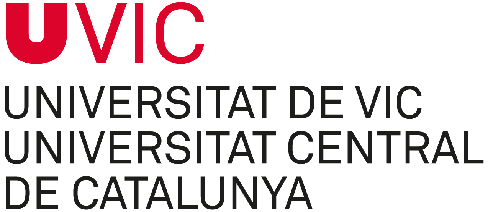

# {-}

Aquest material és la base del curs d’introducció a l'ús **R** i **Rstudio** per l'organització, anàlisi i visualització de dades per a professionals de l'Hospital Althaia.

L’objectiu és proporcionar les eines bàsiques per:

- Importar dades a R

- Processar-les i analitzar-les

- Visualitzar-ne els resultats

- Comunicar els resultats de manera reproduïble

 

## Estructura del llibre i els seus continguts {-}

Cada capítol correspon a una sessió pràctica on es treballaran els següents continguts: 

**Sessió 1.** Primer contacte amb R i el seu entorn   

  Introducció al llenguatge R i a l’entorn de RStudio per entendre què ofereix, com funciona l’espai de treball i com         instal·lar, carregar i utilitzar paquets mentre es creen i manipulen els primers objectes.

**Sessió 2.** De les dades crues a dades analitzables 

  Aprendre a importar diferents tipus de fitxers des de RedCap i transformar dades per preparar conjunts de dades nets,       ordenats i llestos per a l’anàlisi.

**Sessió 3.** Explorar i entendre les dades  

  Explorar i descriure dades mitjançant estadístiques univariants i bivariants, visualitzacions informatives i tècniques      multivariants, incorporant també elements d’estadística inferencial.

**Sessió 4.** Comunicació de resultats i visualització avançada 

  Crear informes professionals amb RMarkdown i generar visualitzacions avançades, personalitzant gràfics, colors i            disposicions per comunicar resultats de manera clara i efectiva.

 

Part d'aquest material, ja sigui de l'estructura com d'alguns exemples, està inspirat en el llibre [R for Data Science (2e)](https://r4ds.hadley.nz/), escrit per Hadley Wickham, Mine Çetinkaya-Rundel, and Garrett Grolemund.

## Desenvolupament de les sessions {-}

Les sessions estan estructurades amb una primera part d'exposició dels continguts amb exemples, seguida d'una segona part pràctica amb propostes d'exercicis i les seves solucions.

## Requisits {-}

-   R i RStudio instal·lats

-   Coneixements bàsics de biociències i estadística  

-   Interès per l’anàlisi de dades i la reproduïbilitat científica 

## Crèdits {-}

Material elaborat per Meritxell Pujolassos Tanyà, docent al **Departament de Biociències de la Universitat de Vic - Universitat Central de Cataluna** i membre del [**Grup de Recerca en Bioinformàtica i Bioimatge**](https://mon.uvic.cat/bi-squared/).

<!-- =======================
     FOOTER INSTITUCION
     ======================= -->

  
  

    Universitat de Vic – Universitat Central de Catalunya
  

  

    Facultat de Ciències, Tecnologia i Enginyeries
    C/ de la Laura, 13 · 08500 Vic (Barcelona)
    meritxell.pujolassos@uvic.cat
  

  

    © `r format(Sys.Date(), '%Y')` UVic‑UCC · Material docent d’ús exclusivament acadèmic.
  

